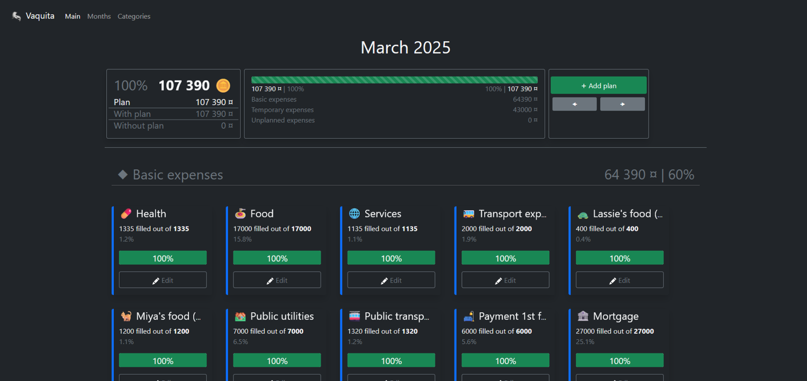
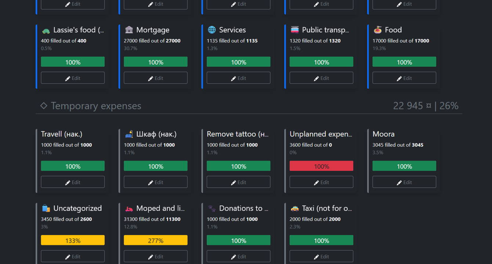
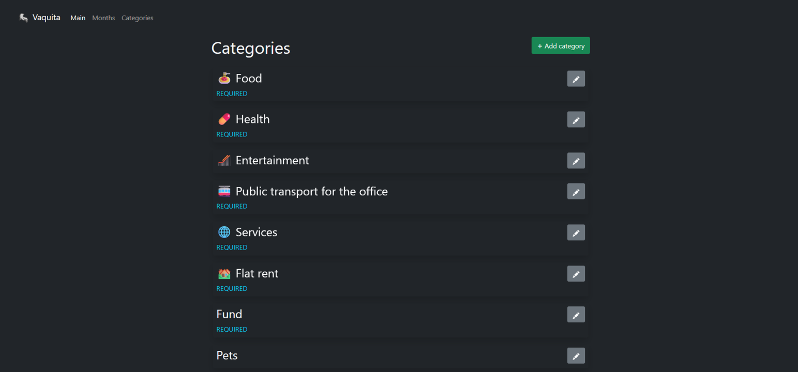

# Vaquita

Money Flow Control Panel, selfhosted-solution worked on PHP 8.1+ and SQLite

* Accounting and planning of monthly expenses
* Categories with emoji
* Percentages and values ​​of expenses and income for basic analytics
* Mandatory expenses, temporary, one-time and additional

### Screenshots

Main page with plans

Different plans with statuses

Categories

## Project deployment

1. Put the files on your server with Apache (the project already has a configured config, but you can use any server with your own configs)
2. In folder `database` rename `database.example.sqlite` to `database.sqlite`

## System requirements

1. PHP 8.1
2. Apache (optionaly)
